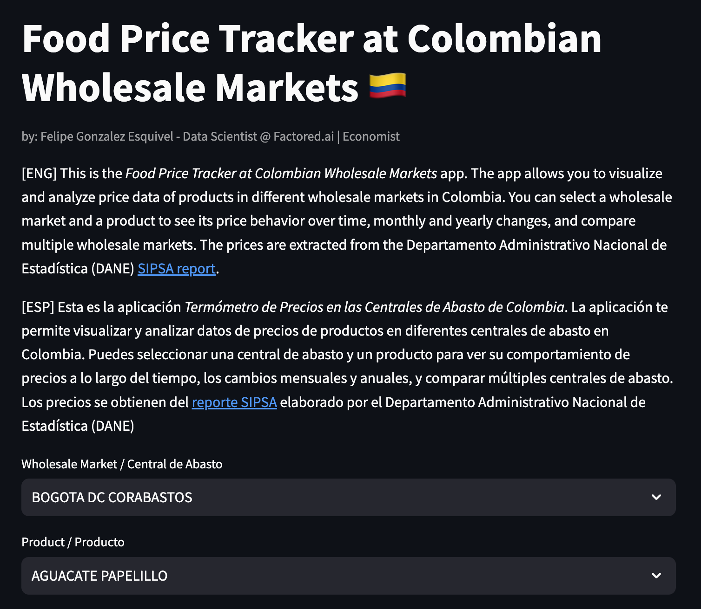

# Food Price Tracker at Colombian Wholesale Markets

Link to the app: https://colombian-food-prices-st.streamlit.app/

## App Screenshot

## Overview
The Food Price Tracker at Colombian Wholesale Markets is a Streamlit web application that allows users to visualize and analyze price data of various products in different wholesale markets in Colombia. Users can select specific markets and products to observe price behavior over time, analyze monthly and yearly price changes, and compare prices across multiple wholesale markets.
The prices are extracted from the Departamento Administrativo Nacional de Estadística (DANE) [SIPSA report](https://www.dane.gov.co/index.php/estadisticas-por-tema/agropecuario/sistema-de-informacion-de-precios-sipsa/servicio-web-para-consulta-de-la-base-de-datos-de-sipsa).
